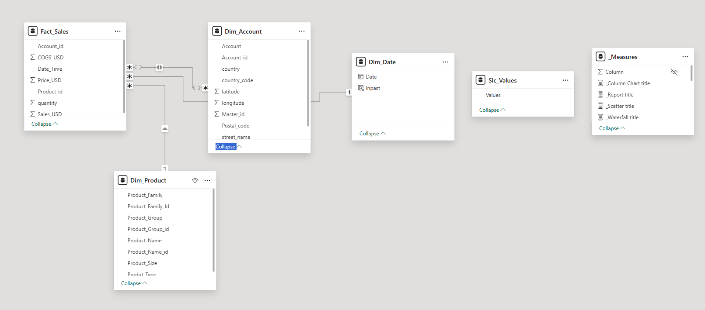
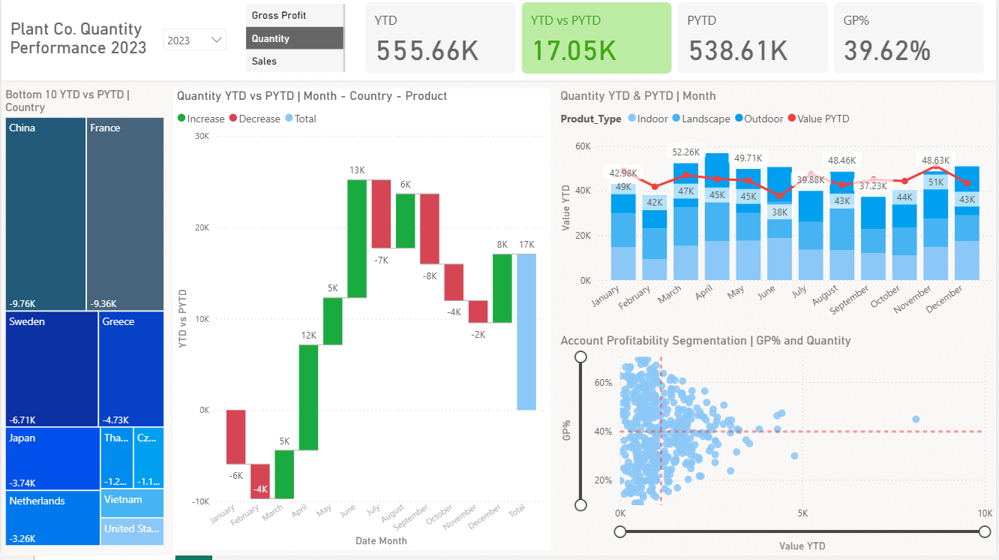
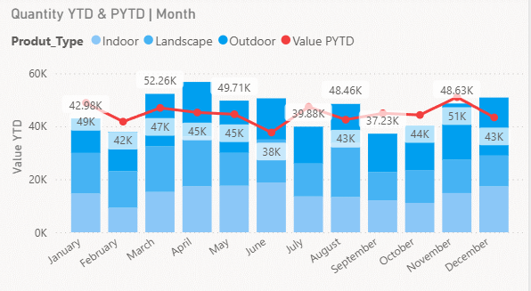
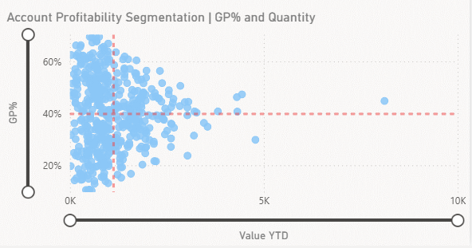
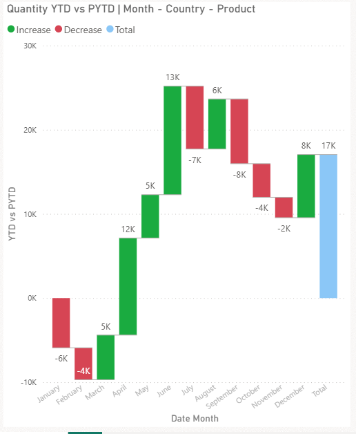

# Power BI Plant Sales Dashboard

## Overview
This project showcases an interactive Power BI dashboard designed to analyze plant-related sales performance across regions, products, and customers. This dashboard provides clear visibility into key business metrics such as total sales, quantity, gross profit, and year-over-year performance.

By transforming raw Excel data into meaningful insights, this project highlights my ability to perform data modeling, build dynamic visualizations, and support data-driven decision-making.

---
## Key Skills Demonstrated
- Building interactive dashboards in Power BI
- Writing DAX measures for business KPIs
- Data modeling using star schema design
- Transforming raw Excel data into actionable insights
- Identifying trends, performance gaps, and growth opportunities
- Communicating insights through clean, user-friendly visuals

---

## Key Features

###  Data Model Design
- Built a structured data model with fact and dimension tables:
  - Fact_Sales
  - Dim_Product
  - Dim_Account
  - Dim_Date

---
### Executive KPI Overview
- Total Quantity YTD: 555.66K  
- Previous Year: 538.61K  
- Growth (YTD vs PYTD): +17.05K  
- Gross Profit Margin: 39.62%  

---

### Monthly Performance Trends
- Tracks quantity trends across months
- Compares product types (Indoor, Landscape, Outdoor)
- Includes previous year comparison for performance benchmarking

---

### Profitability Segmentation
- Scatter plot analyzing GP%
- Identifies high-value and high-profit customer segments
- Helps highlight opportunities for optimization

---

### Country Performance Analysis
- Displays bottom-performing countries based on YTD vs PYTD
- Highlights areas needing improvement

---

### Quantity Variance Breakdown
- Waterfall chart showing increases and decreases across months
- Clearly visualizes how performance builds to total yearly growth

---
